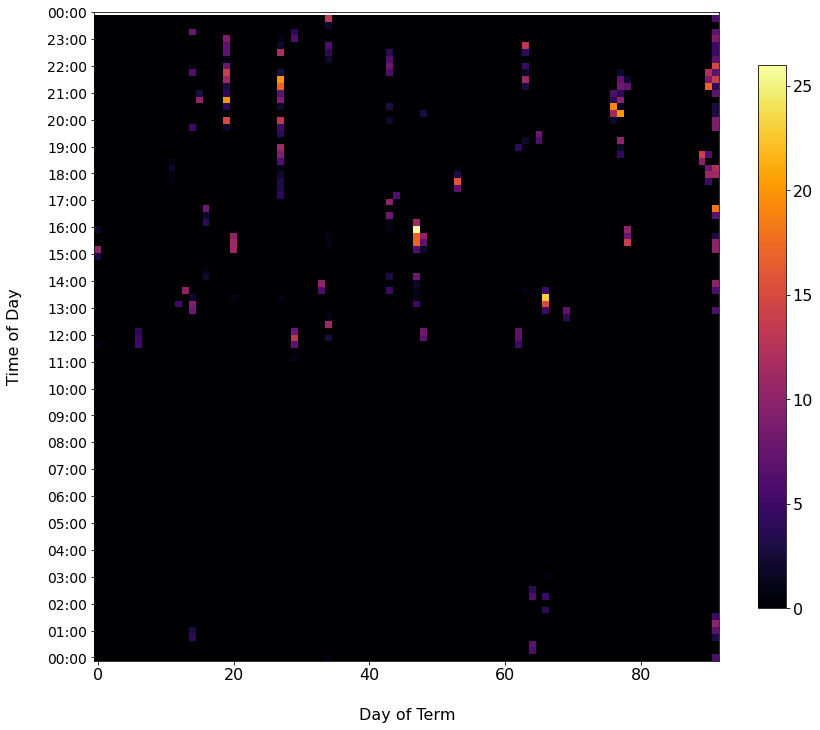

# DVATIHCRBMCS136C
Data Visualization of All the Times I Hit the Compile and Run Button in My CS136 Class

[Check out the notebook here](https://github.com/qhyun2/DVATIHCRBMCS136C/blob/master/Visualizations.ipynb)

### Try it yourself
To use your own data replace `data/out.txt` with your own file of the same format.

### Results
#### Day of week

#### Time of day

#### Day of term

#### Heatmap

